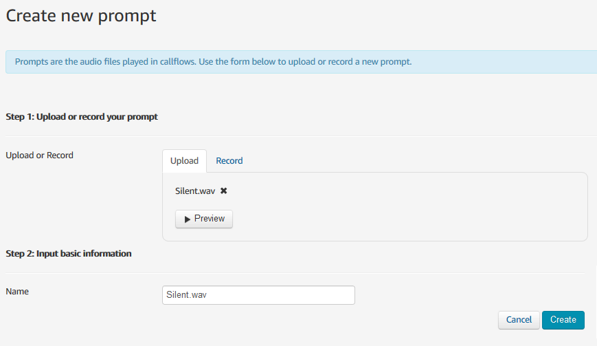

# Amazon Connect Real-time transcription and recording proof of concept.

Making it easy to get started with Amazon Connect live audio streaming and real-time transcription using Amazon Transcribe.
The main concept is the idea of a voicemail type service built on top of Amazon Connect using these services.

---
> **Please note full credit for the Java Lambda function `transcriber` goes to this project on github: [amazon-connect-realtime-transcription](https://github.com/amazon-connect/amazon-connect-realtime-transcription)**
---

## Prerequisities
This project uses the [SAM CLI](https://docs.aws.amazon.com/serverless-application-model/latest/developerguide/serverless-sam-cli-install.html) to package the CloudFormation template and Lambda function zip files. Therefore you will need to have this installed before running the steps below.

## Project Overview
The purpose of this project is to provide a sample solution for recording and transcribing inbound phone calls handled by Amazon Connect. It has the following capabilities:
- Live transcription of call audio. Written to a DynamoDB table in near real-time.
- Recording of the entire call is written to S3 at the end of the call
- No Agent is required in Amazon Connect, this solution is expected to be entirely automated.
- During the call, live transcription results are monitored for keywords. If a keyword is detected an alert is published to SNS with basic call details included.
- At the end of the call, full call details (including the S3 recording link) are published to SNS.

## Architecture Overview
Everything possible is deployed using AWS CloudFormation. However, at this time Amazon Connect does not support deployment or configuration through API or CloudFormation so these steps will require manual entry. Full details of the resources deployed by CloudFormation are shown in the following table:
| Type                      | Description |
|---------------------------|-------------|
| AWS::S3::Bucket           | S3 Bucket for Recordings. |
| AWS::DynamoDB::Table      | Table to hold unique "call" summaries. |
| AWS::DynamoDB::Table      | Table to hold inbound transcription segments. Includes DynamoDB Stream. |
| AWS::DynamoDB::Table      | Table to hold outbound transcription segments. |
| AWS::SNS::Topic           | Topic to handle Key Word trigger alerts. |
| AWS::SNS::Subscription    | Adding an email subscription to the SNS topic if an email address is supplied. |
| AWS::SSM::Parameter       | Parameter to store the comma-delimited list of keywords to watch for. |
| AWS::Lambda::Function     | Lambda Function to capture initial call details in DynamoDB. Includes associated IAM Role and Permission for Connect. |
| AWS::Lambda::Function     | Lambda Function to trigger the Transcribe Lambda function async. Includes associated IAM Role and Permission for Connect. |
| AWS::Lambda::Function     | Lambda Function to process the Kinesis Video Stream from Connect. Includes associated IAM Role. |
| AWS::Lambda::Function     | Lambda Function to update the Contact details DynamoDB record when the call is complete as triggered by full recording being written to S3. Includes associated IAM Role and Permission for S3. |
| AWS::Lambda::Function     | Lambda Function to check the completed DynamoDB inbound segments for keywords. Includes associated IAM Role and Event Trigger for DynamoDB. |
| AWS::Lambda::Function     | Lambda Function to publish the details of the completed connect call. Includes associated IAM Role and Event Trigger for DynamoDB. |
| AWS::Lambda::Function     | Lambda Function to create the Connect configuration files and write them to S3. This function is called by a custom resource. Includes associated IAM Role. |
| AWS::Lambda::LayerVersion | Lambda Layer to hold the Python Requests library. |
| Custom::ContactFlows      | CloudFormation custom resource to call the Contact Flows Lambda function. |

### Deployment

#### SAM Package

After cloning or downloading this project the first step is to package up the CloudFormation template using the sam cli. Execute the following command in the root of the project folder once cloned (or downloaded). Please note you will need to replace the `my-bucket` name of the S3 bucket with your bucket and your sam cli credentials will need to have access to upload files to this bucket:

```bash
sam package --s3-bucket my-bucket --s3-prefix tmp --output-template-file ./deployment/template.yaml
```

The result of this command will be a new `template.yaml` file in the `deployment` folder. This is the template that you will use to create the CloudFormation Stack.

#### CloudFormation Stack

> Please **note** this the CloudFormation stack should only be created in a region that supports Amazon Connect. This ensures that all the Lambda functions has as low latency as possible and keeps the solution as smooth as possible. The supported regions are:
> - ap-northeast-1 (Tokyo)
> - ap-southeast-1 (Singapore)
> - ap-southeast-2 (Sydney)
> - eu-central-1 (Frankfurt)
> - eu-west-2 (London)
> - us-east-1 (N. Virginia)
> - us-west-2 (Oregon)

Use the CloudFormation user interface in the AWS web console to create a new stack from this template. You will be given the option to provide 2 parameter values:
- EmailAddress - (Optional) Provide this if you wish to receive notifications from SNS when keywords are detected during a call and full call details at the end of each call.
- KeyWords - This is the comma-delimited list of keywords that will be detected during calls to trigger alerts.
Leave all other options default and create the CloudFormation stack.

While the stack is creating we can carry out the manual configuration required within Amazon Connect:

#### Amazon Connect - Instance configuration

If you already have an instance of Amazon Connect in this region (the same region as we deployed the CloudFormation stack into) then there is no need to create another. You just need to ensure that Inbound Call handling is available. If it is not you can edit your existing instance to add this.
Please create a new Amazon Connect Instance if you do not have one and ensure Inbound Call handling is enabled.


Next, we need to ensure that **Live Media Streaming** is enabled for the instance. If you already have this enabled you do not need to change anything, if you don't you need to enable this now.
To do this access the **Data Storage** settings of the instance:


> Please **note** that this is not the same setting as **Data Streaming**, we need **Live Media Streaming** for this project.

If you have any other settings enabled on the Connect Instance you can leave them unchanged. We are not going to be affected by other recording or logging settings. You may wish to enabled logging if you wish to aid in any debugging you plan to do but there is no requirement for this solution so we are leaving this choice to you.

The final steps we need to take before we delve into the Connect Contact flows themselves are to ensure that Connect is aware of the Lambda functions that it needs to perform its tasks. This is done from the **Contact flow** heading:


We need to add 2 Lambda functions here. The names of the Lambda functions will be different every time you deploy this solution. However, the will always have some common element to their names. The two names we are looking for are those with the following substrings within the name:
- CaptureContactDetails
- TriggerTranscriber
Choose each one of these in turn from the dropdown and click **Add Lambda Function**

After you have done this the Lambda Functions section should look like this:
> Please **note** if you are already using Lambda functions with Amazon Connect you may find there are already other functions in this list. Do not remove them, just add the new ones we need.


#### Amazon Connect - Contact Flow Configuration

Next, we will be logging into the Connect instance itself to complete the configuration.

> You will need to wait for the CloudFormation stack to complete before proceeding any further if it is not already complete.

The CloudFormation stack will have created an **S3 Bucket** for the recordings to be stored in but also for some output files from the stack that we will be using now. Therefore please download the following 3 files from the S3 bucket that was created. You can find the name of the s3 bucket created by checking the outputs tab of your CloudFormation stack.
- `'Silent.wav`
- `silent_hold_queue.json`
- `streaming_flow.json`

> Please note these files **must be downloaded** from the S3 bucket, as the ones from the project folder are not complete and may cause problems if you try to use them.

Once you have these files, now please open/login to the Connect instance:


##### Create Prompt

The first thing we need to do is create a new prompt. We will import the `Silent.wav` file we downloaded in the last step. This silent file is required so that we can place the caller on "hold" to mimic a voicemail solution but not have them hear music whilst they are leaving a message.

Open the **Prompts** area within Connect to add a new prompt:


Choose the **Create new prompt** button to create a new prompt, **Choose file** to upload the `Silent.wav` file from S3 and **Create** to save it. It is important to leave the name as the default (Silent.wav) so that the Contact Flows can find the correct prompt to use.



##### Create Queue Flow

Next, we will create the queue flow that uses this new prompt. From the **Routing** menu choose **Contact flows**. Then click the arrow button next to **Create contact flow** and choose the option **Create customer queue flow**:


In the top right-hand corner of the next screen, you will see a **Save** button (that is disabled) and an arrow next to it (which is not). Click this arrow to give you the option to **Import flow (beta)**:
On the following screen click **Select** and browse to the `silent_hold_queue.json` file you downloaded earlier from S3, click **Import** to complete the creation of the flow.

You will now see a visualisation of the simple flow we are importing. It will have a warning flag next to the **Loop prompts** this is expected so do not worry. If you expand it you will see that Connect has automatically updated the reference to the correct file (that we imported in the previous step). From the top right **Save** menu arrow choose the option to **Save & Publish**:


##### Create Contact Flow

Now we will create the contact flow that handles the actual call logic itself. From the **Routing** menu choose **Contact flows**. Then click **Create contact flow**.

In the top right-hand corner of the next screen, you will see a **Save** button (that is disabled) and an arrow next to it (which is not). Click this arrow to give you the option to **Import flow (beta)**:
On the following screen click **Select** and browse to the `streaming_flow.json` file you downloaded earlier from S3, click **Import** to complete the creation of the flow.

You will now see a visualisation of the flow we are importing. It will have a couple of warning flags but, as before this is expected so do not worry. If you expand them you will see that again Connect has automatically updated the references. From the top right **Save** menu arrow choose the option to **Save & Publish**:


> Please **note** the **Set contact attributes** step in this flow sets some of the behaviours of the recording and transcribing functions. So feel free to take a look at these settings either now or later. You will also find some more settings in the environment variables of the Transcriber Lambda function so again feel free to familiarise yourself with this too.

##### Configure Phone Number

Finally, the last part of the configuration is linking this new contact flow to a phone number so that the flow is invoked when that number is called.
If you already have a number claimed and are willing to re-assign it to this flow then go ahead. Otherwise, go ahead and claim a new number and assign the **Streaming flow** to that number.

Once you have done all this wait a few minutes for all the configuration to become live.

### Usage

The flow is easily invoked by making a phone call to the claimed number. You will hear the automated system greet you and inform you that the audio will be streamed. You will find that on first execution the beep can take a couple of seconds after the voice has stopped speaking and also the audio streaming may be slightly delayed from the start of the call. These are both areas we are working to improve in this solution.

However, if you say one of the keywords during the call you should find an email is received alerting you to the fact. If you are on the phone long enough the email may arrive before you hang up.
Once you do hang up you will get a further email with details of the call and the location of the full recording file in S3. Please note the url link is there to guide you. Since we are not making our S3 bucket public you will find the link does not work, this is expected.
